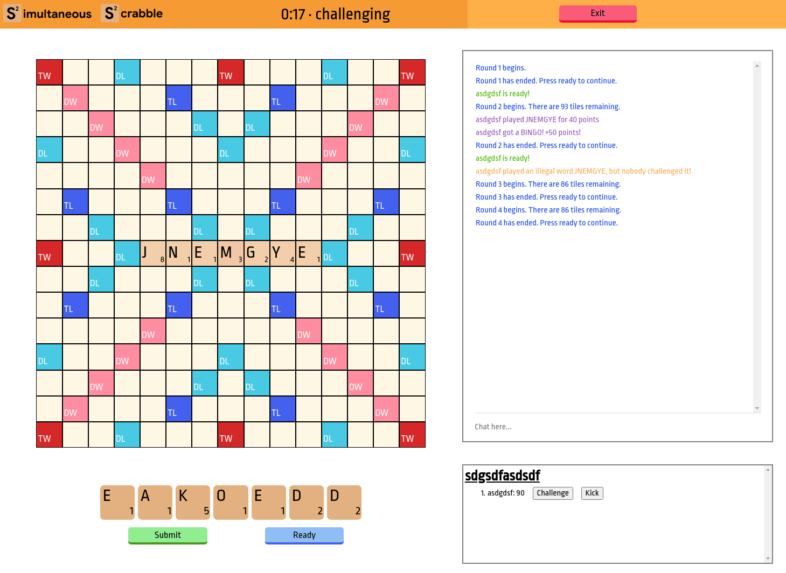
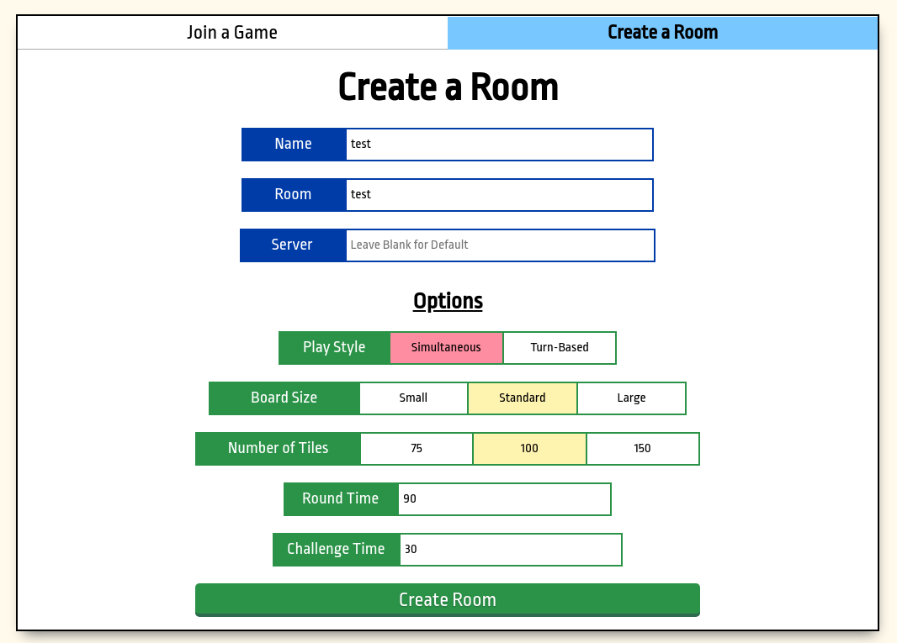

## Overview
Simultaneous Scrabble is a concept for an online multiplayer game for 2-10 players. Its pace of play is significantly faster than normal scrabble, making it more accessible in a casual or party setting.

**Play the game at [scrabble.bencuan.me][scrabble]!**

## How To Play

The base rules are the same as [Scrabble](https://scrabble.hasbro.com/en-us/rules). Everything should also apply to Simultaneous Scrabble (with the exception of rules relating to turn-based play).

Simultaneous Mode runs in **rounds** until the game ends (someone uses all of their letters). Each round consists of two phases: the **Play Phase**, where players can place their tiles, and the **Challenge Phase**, where players get to dispute questionable plays (e.g. `QWXIY`).

### Play Phase
During this time, it's a free-for-all: place your tiles as quickly as possible to ensure others don't take your spot! 

You can also play onto words placed on that same round, so if there are no openings it may be beneficial to wait for another player to make their turn as well.

Pressing the 'Ready' button during this phase indicates that you wish to skip your turn.

### Challenge Phase
Players are not allowed to make moves during this time. If anyone wishes to challenge, you may press the 'Challenge' button next to any other player's name. The challenge works as follows:
 - All words placed by the player in question from the immediately preceeding Play Phase will be looked up in the dictionary.
 - If any one of the words played by that player are invalid, the challenged player loses their next turn. The letters placed remain, however (so this could be a viable strategy for getting rid of bad letters).
 - If all of the words were valid, then you (as the challenger) lose your next turn.

If no challenges need to be made, players can press the 'Ready' button to advance to the next round.

## Room Options

| Option      | Description |
| ----------- | ----------- |
| Name      | Your username.    |
| Room   | The name of the room. Players will enter this in to connect.      |
| Server   | If connecting to localhost or a custom server, you can optionally enter in an address here (it should be in form `<your server name here>:3000`).     |
| Play Style  | In **Simultaneous Mode**, all players make their moves at the same time. **Turn-Based Mode** is similar to traditional Scrabble. Simultaneous is strongly recommended for larger games (>4 players). |
| Board Size     | **Standard** is a traditional Scrabble board layout (15x15). **Small** is 11x11 and **Large** is 19x19. Small and Large have custom modifier layouts. |
| Number of Tiles | The number of tiles in the bag (normal Scrabble has 100 tiles). The game ends when all tiles are used. |
| Round Time | The time (in seconds) for each play round. For Turn-Based Mode, this is the time each player gets to play per round. Set to 0 to disable the timer. |
|Challenge Time | The time (in seconds) for each challenge round, which happens in between play rounds. Set to 0 to disable the timer. |

## Installation

If you just want to play, feel free to hop onto [scrabble.bencuan.me][scrabble]. The following instructions are for developers and those who wish to customize the game further.

Make sure that you have `nodejs` installed.

1. Clone the repository: `https://github.com/64bitpandas/SimultaneousScrabble`

2. Install dependencies: `npm i`

3. Run the nodemon server: `npm start`

4. If doing frontend development, you can instead run `npx node server` which will hot-reload any frontend changes (but not backend changes).

By default, the frontend is served to `localhost:3001` and the backend listens to `localhost:3000`. Navigate to `localhost:3001` to play! (**Note that you will need to enter `DEBUG` or `localhost` into the 'Server' box to avoid connecting to the main server.**)

## Deployment

The app is best deployed with separate handling for frontend and backend.

For the frontend, run `npm run build` and the app should be available to you in the `build/` folder.

For the backend, `npm start` is good enough. The backend will automatically bind to available ports (if the `PORT` variable is set), and falls back to `3000` if none are found in your environment.

## Credits

Created by [Ben Cuan](https://bencuan.me) using Node.js, Express, Socket.io, React

Definition lookups and wordlist are accredited to [jscrab](https://github.com/amnond/jscrab/tree/master/lang).

[scrabble]: https://scrabble.bencuan.me
